# Clyvo Vet — Banco de Dados Oracle

## Sobre o Projeto

O Clyvo Vet é uma plataforma digital de saúde animal que conecta tutores de pets, veterinários e clínicas parceiras. Este banco de dados suporta todas as operações da plataforma: cadastro de pets, agendamento de consultas, carteirinha digital com QR Code, histórico clínico portável entre clínicas, lembretes via WhatsApp e score de saúde do animal.

O banco foi projetado para Oracle XE / SQL Developer, compatível com o ambiente da FIAP.

---

## Integrantes do Grupo

| Nome | RM |
|---|---|
| Fabrício Henrique Pereira | RM 563237 |
| Leonardo José Pereira | RM 563065 |
| Miguel Henrique Oliveira Dias | RM 565492 |
| Pedro Henrique de Oliveira | RM 562312 |

---

## Como Executar

### Pré-requisitos
- Oracle SQL Developer instalado
- Conexão com o banco Oracle XE da FIAP configurada
- Todos os arquivos `.sql` na mesma pasta

### Passo a passo

1. Abra o Oracle SQL Developer
2. Conecte-se ao banco Oracle XE
3. Abra o arquivo `00_EXECUTE_ALL.sql`
4. No menu superior, clique em **Run Script** (F5)
5. Aguarde a execução completa
6. Verifique o painel de saída — deve aparecer a mensagem `CLYVO VET -- Banco criado com sucesso!`

### Atenção

Execute sempre na ordem correta. O script mestre `00_EXECUTE_ALL.sql` já garante isso. Não execute os arquivos individualmente fora de ordem, pois as procedures dependem das tabelas e os seeds dependem das procedures.

---

## Estrutura dos Arquivos

```
clyvovet-db/
├── 00_EXECUTE_ALL.sql       Script mestre — executa tudo em ordem
├── 01_DDL_TABLES.sql        Sequences, tabelas e constraints
├── 02_DDL_INDEXES.sql       Índices otimizados para performance
├── 03_VIEWS.sql             Views para consultas consolidadas
├── 04_PROCEDURES.sql        Procedures de carga com tratamento de erros
├── 05_SEED_DATA.sql         Dados iniciais: clínicas, vets, tutor e pet
├── 06_BLOCOS_ANONIMOS.sql   Consultas, relatórios e bloco LAG/LEAD
└── README.md                Esta documentação
```

---

## Diagrama MER

```mermaid
erDiagram

    tb_log_erros {
        NUMBER id PK
        VARCHAR2 nome_procedure
        VARCHAR2 nome_usuario
        TIMESTAMP data_erro
        NUMBER codigo_erro
        VARCHAR2 mensagem_erro
    }

    tb_enderecos {
        NUMBER id PK
        VARCHAR2 logradouro
        VARCHAR2 bairro
        VARCHAR2 cidade
        VARCHAR2 estado
        VARCHAR2 cep
        NUMBER latitude
        NUMBER longitude
        TIMESTAMP criado_em
    }

    tb_usuarios {
        NUMBER id PK
        VARCHAR2 nome
        VARCHAR2 email
        VARCHAR2 telefone
        VARCHAR2 senha_hash
        VARCHAR2 perfil
        VARCHAR2 idioma
        NUMBER ativo
        NUMBER endereco_id FK
        TIMESTAMP criado_em
    }

    tb_animais {
        NUMBER id PK
        VARCHAR2 nome
        VARCHAR2 especie
        VARCHAR2 raca
        VARCHAR2 sexo
        DATE data_nascimento
        NUMBER peso_kg
        VARCHAR2 codigo_microchip
        VARCHAR2 modalidade
        NUMBER ativo
        TIMESTAMP criado_em
    }

    tb_donos_animal {
        NUMBER id PK
        NUMBER animal_id FK
        NUMBER usuario_id FK
        VARCHAR2 papel
        TIMESTAMP criado_em
    }

    tb_scores_saude {
        NUMBER id PK
        NUMBER animal_id FK
        NUMBER pontuacao
        NUMBER pontuacao_nutricao
        NUMBER pontuacao_atividade
        NUMBER pontuacao_vacina
        TIMESTAMP registrado_em
    }

    tb_carteirinhas {
        NUMBER id PK
        NUMBER animal_id FK
        VARCHAR2 token_qr_code
        VARCHAR2 numero_registro
        TIMESTAMP valido_ate
        NUMBER publico
    }

    tb_vacinas_carteirinha {
        NUMBER id PK
        NUMBER carteirinha_id FK
        VARCHAR2 nome_vacina
        VARCHAR2 situacao
        DATE aplicada_em
        DATE valida_ate
    }

    tb_clinicas {
        NUMBER id PK
        VARCHAR2 nome
        NUMBER endereco_id FK
        VARCHAR2 telefone
        VARCHAR2 email
        NUMBER parceira
        NUMBER atende_domicilio
        NUMBER aberta_24h
        NUMBER media_avaliacao
        NUMBER ativo
        TIMESTAMP criado_em
    }

    tb_horarios_clinica {
        NUMBER id PK
        NUMBER clinica_id FK
        NUMBER dia_semana
        VARCHAR2 abre_as
        VARCHAR2 fecha_as
        NUMBER fechado
    }

    tb_veterinarios {
        NUMBER id PK
        NUMBER usuario_id FK
        VARCHAR2 nome
        VARCHAR2 crm
        VARCHAR2 especialidade
        NUMBER anos_experiencia
        NUMBER media_avaliacao
        NUMBER disponivel
        TIMESTAMP criado_em
    }

    tb_vet_clinicas {
        NUMBER id PK
        NUMBER veterinario_id FK
        NUMBER clinica_id FK
        NUMBER principal
        TIMESTAMP criado_em
    }

    tb_agendas_vet {
        NUMBER id PK
        NUMBER veterinario_id FK
        NUMBER clinica_id FK
        NUMBER dia_semana
        VARCHAR2 hora_inicio
        VARCHAR2 hora_fim
        NUMBER duracao_slot_min
        NUMBER max_slots
        NUMBER ativo
    }

    tb_bloqueios_vet {
        NUMBER id PK
        NUMBER veterinario_id FK
        DATE data_bloqueio
        VARCHAR2 hora_inicio
        VARCHAR2 hora_fim
        VARCHAR2 motivo
    }

    tb_consultas {
        NUMBER id PK
        NUMBER animal_id FK
        NUMBER dono_id FK
        NUMBER veterinario_id FK
        NUMBER clinica_id FK
        VARCHAR2 especialidade
        DATE data_consulta
        VARCHAR2 hora_consulta
        NUMBER duracao_min
        VARCHAR2 tipo_atendimento
        VARCHAR2 situacao
        VARCHAR2 observacoes_dono
        VARCHAR2 observacoes_vet
        TIMESTAMP criado_em
    }

    tb_lembretes_consulta {
        NUMBER id PK
        NUMBER consulta_id FK
        TIMESTAMP lembrar_em
        VARCHAR2 canal
        VARCHAR2 situacao
    }

    tb_eventos_saude {
        NUMBER id PK
        NUMBER animal_id FK
        VARCHAR2 tipo
        VARCHAR2 nome
        DATE data_prevista
        DATE realizado_em
        VARCHAR2 situacao
        NUMBER criado_por FK
        TIMESTAMP criado_em
    }

    tb_registros_vacina {
        NUMBER id PK
        NUMBER animal_id FK
        NUMBER veterinario_id FK
        NUMBER clinica_id FK
        VARCHAR2 nome_vacina
        VARCHAR2 numero_lote
        DATE data_aplicacao
        DATE data_proxima_dose
    }

    tb_documentos_animal {
        NUMBER id PK
        NUMBER animal_id FK
        VARCHAR2 tipo
        VARCHAR2 nome
        VARCHAR2 url_arquivo
        VARCHAR2 idioma
        DATE emitido_em
        NUMBER enviado_por FK
        TIMESTAMP criado_em
    }

    tb_notificacoes {
        NUMBER id PK
        NUMBER usuario_id FK
        VARCHAR2 tipo
        VARCHAR2 titulo
        VARCHAR2 mensagem
        NUMBER lido
        TIMESTAMP criado_em
    }

    tb_avaliacoes {
        NUMBER id PK
        NUMBER avaliador_id FK
        VARCHAR2 tipo_alvo
        NUMBER id_alvo
        NUMBER consulta_id FK
        NUMBER nota
        VARCHAR2 comentario
        TIMESTAMP criado_em
    }

    tb_enderecos    ||--o{  tb_usuarios           : "endereco_id"
    tb_enderecos    ||--o{  tb_clinicas            : "endereco_id"
    tb_animais      ||--|{  tb_donos_animal        : "animal_id"
    tb_usuarios     ||--|{  tb_donos_animal        : "usuario_id"
    tb_animais      ||--o{  tb_scores_saude        : "animal_id"
    tb_animais      ||--||  tb_carteirinhas        : "animal_id"
    tb_carteirinhas ||--o{  tb_vacinas_carteirinha : "carteirinha_id"
    tb_clinicas     ||--|{  tb_horarios_clinica    : "clinica_id"
    tb_usuarios     ||--||  tb_veterinarios        : "usuario_id"
    tb_veterinarios ||--|{  tb_vet_clinicas        : "veterinario_id"
    tb_clinicas     ||--|{  tb_vet_clinicas        : "clinica_id"
    tb_veterinarios ||--o{  tb_agendas_vet         : "veterinario_id"
    tb_clinicas     ||--o{  tb_agendas_vet         : "clinica_id"
    tb_veterinarios ||--o{  tb_bloqueios_vet       : "veterinario_id"
    tb_animais      ||--o{  tb_consultas           : "animal_id"
    tb_usuarios     ||--o{  tb_consultas           : "dono_id"
    tb_veterinarios ||--o{  tb_consultas           : "veterinario_id"
    tb_clinicas     ||--o{  tb_consultas           : "clinica_id"
    tb_consultas    ||--|{  tb_lembretes_consulta  : "consulta_id"
    tb_animais      ||--o{  tb_eventos_saude       : "animal_id"
    tb_usuarios     |o--o{  tb_eventos_saude       : "criado_por"
    tb_animais      ||--o{  tb_registros_vacina    : "animal_id"
    tb_veterinarios |o--o{  tb_registros_vacina    : "veterinario_id"
    tb_clinicas     |o--o{  tb_registros_vacina    : "clinica_id"
    tb_animais      ||--o{  tb_documentos_animal   : "animal_id"
    tb_usuarios     |o--o{  tb_documentos_animal   : "enviado_por"
    tb_usuarios     ||--o{  tb_notificacoes        : "usuario_id"
    tb_usuarios     ||--o{  tb_avaliacoes          : "avaliador_id"
    tb_consultas    |o--o{  tb_avaliacoes          : "consulta_id"
```



---

## Arquitetura do Banco

O banco está organizado em 8 domínios funcionais com 21 tabelas:

```
ENDEREÇOS ─────────────────────────────────────────────────
  tb_enderecos          Logradouro, bairro, cidade, estado,
                        CEP e coordenadas — reutilizado por
                        clínicas e usuários

USUÁRIOS ──────────────────────────────────────────────────
  tb_usuarios           Tutores, veterinários e admins

ANIMAIS ───────────────────────────────────────────────────
  tb_animais            Perfil completo do animal
  tb_donos_animal       Relação tutor-animal (vários tutores)
  tb_scores_saude       Snapshots periódicos do score de saúde

CARTEIRINHA DIGITAL ───────────────────────────────────────
  tb_carteirinhas       Cartão passaporte com QR Code único
  tb_vacinas_carteirinha Badges de vacinas exibidos no cartão

CLÍNICAS ──────────────────────────────────────────────────
  tb_clinicas           Clínicas parceiras (com FK para tb_enderecos)
  tb_horarios_clinica   Horários de funcionamento por dia

VETERINÁRIOS ──────────────────────────────────────────────
  tb_veterinarios       Profissionais vinculados às clínicas
  tb_vet_clinicas       Vet pode atuar em múltiplas clínicas
  tb_agendas_vet        Disponibilidade semanal por clínica
  tb_bloqueios_vet      Bloqueios pontuais (folga, reunião)

AGENDAMENTOS ──────────────────────────────────────────────
  tb_consultas          Consultas agendadas
  tb_lembretes_consulta Lembretes automáticos (WhatsApp/push)

SAÚDE & DOCUMENTOS ────────────────────────────────────────
  tb_eventos_saude      Todos os eventos de saúde do animal
  tb_registros_vacina   Registros oficiais de vacinação
  tb_documentos_animal  Arquivos e documentos do animal

COMUNICAÇÃO & RELACIONAMENTO ──────────────────────────────
  tb_notificacoes       Feed de notificações in-app
  tb_avaliacoes         Avaliações de clínicas e vets

SISTEMA ───────────────────────────────────────────────────
  tb_log_erros          Log de erros das procedures
```

---

## Detalhamento das Tabelas

### tb_enderecos
Tabela centralizada de endereços, compartilhada por `tb_clinicas` e `tb_usuarios`. Evita repetição de colunas de endereço em múltiplas tabelas.

| Campo | Tipo | Descrição |
|---|---|---|
| id | NUMBER | PK gerada pela sequence seq_enderecos |
| logradouro | VARCHAR2(300) | Rua, avenida ou alameda com número |
| bairro | VARCHAR2(150) | Bairro (opcional) |
| cidade | VARCHAR2(100) | Cidade |
| estado | VARCHAR2(50) | Estado |
| cep | VARCHAR2(10) | CEP (opcional) |
| latitude | NUMBER(10,7) | Latitude para geolocalização |
| longitude | NUMBER(10,7) | Longitude para geolocalização |

---

### tb_usuarios
Centraliza todos os perfis de acesso da plataforma.

| Campo | Tipo | Descrição |
|---|---|---|
| id | NUMBER | PK gerada pela sequence seq_usuarios |
| nome | VARCHAR2(150) | Nome completo |
| email | VARCHAR2(200) | Email único — usado para login |
| telefone | VARCHAR2(20) | Telefone para WhatsApp |
| senha_hash | VARCHAR2(255) | Senha criptografada |
| perfil | VARCHAR2(20) | dono / veterinario / admin_clinica / super_admin |
| idioma | VARCHAR2(5) | Idioma preferido: pt / en / es |
| endereco_id | NUMBER | FK para tb_enderecos (opcional) |
| ativo | NUMBER(1) | 1=ativo, 0=inativo |

---

### tb_animais
Perfil completo do animal. Suporta as 3 modalidades da plataforma.

| Campo | Tipo | Descrição |
|---|---|---|
| id | NUMBER | PK |
| nome | VARCHAR2(100) | Nome do animal |
| especie | VARCHAR2(30) | cao / gato / ave / reptil / roedor / fazenda / selvagem / outro |
| raca | VARCHAR2(100) | Raça — usada para alertas de predisposição genética |
| sexo | VARCHAR2(15) | macho / femea / desconhecido |
| data_nascimento | DATE | Data de nascimento — base para alertas por fase de vida |
| peso_kg | NUMBER(5,2) | Peso em kg |
| codigo_microchip | VARCHAR2(50) | Código do microchip (único) |
| modalidade | VARCHAR2(15) | domestico / agropecuario / selvagem |
| ativo | NUMBER(1) | 1=ativo, 0=inativo |

---

### tb_donos_animal
Permite que um animal tenha múltiplos tutores (família). Um animal sempre tem exatamente um tutor com `papel = principal`.

| Campo | Tipo | Descrição |
|---|---|---|
| animal_id | NUMBER | FK para tb_animais |
| usuario_id | NUMBER | FK para tb_usuarios |
| papel | VARCHAR2(15) | principal / secundario |

---

### tb_scores_saude
Snapshots periódicos calculados pela plataforma. A pontuação geral vai de 0 a 100 e é composta pelos sub-scores de vacina, nutrição e atividade.

| Campo | Tipo | Descrição |
|---|---|---|
| pontuacao | NUMBER(5,2) | Score geral de 0 a 100 |
| pontuacao_vacina | NUMBER(5,2) | Score de adesão vacinal |
| pontuacao_nutricao | NUMBER(5,2) | Score nutricional |
| pontuacao_atividade | NUMBER(5,2) | Score de atividade física |
| registrado_em | TIMESTAMP | Data do snapshot |

---

### tb_carteirinhas
Carteirinha digital passaporte do animal. O `token_qr_code` é único, gerado com `SYS_GUID()`, e é usado para acesso externo ao histórico do animal.

| Campo | Tipo | Descrição |
|---|---|---|
| token_qr_code | VARCHAR2(36) | UUID único escaneável pelo vet |
| numero_registro | VARCHAR2(50) | Número de registro oficial |
| valido_ate | TIMESTAMP | Validade da carteirinha |
| publico | NUMBER(1) | Se o QR Code pode ser lido por qualquer pessoa |

---

### tb_vacinas_carteirinha
Badges de vacinas exibidos na carteirinha digital. Situação `ok` aparece em verde, `pendente` em amarelo e `vencida` em vermelho.

---

### tb_clinicas
Clínicas parceiras da plataforma. O endereço, cidade, estado e coordenadas ficam em `tb_enderecos` (FK `endereco_id`). `atende_domicilio` indica se a clínica oferece consultas domiciliares.

| Campo | Tipo | Descrição |
|---|---|---|
| endereco_id | NUMBER | FK para tb_enderecos |
| parceira | NUMBER(1) | Se aparece no mapa da plataforma |
| atende_domicilio | NUMBER(1) | Atendimento domiciliar disponível |
| aberta_24h | NUMBER(1) | Plantão 24 horas |
| media_avaliacao | NUMBER(3,2) | Média calculada a partir de tb_avaliacoes |

---

### tb_horarios_clinica
Horários de funcionamento por dia da semana (0=domingo, 6=sábado). `fechado=1` indica que a clínica não funciona naquele dia.

---

### tb_veterinarios
Veterinários da plataforma. Um vet é sempre também um registro em `tb_usuarios` com perfil `veterinario`.

| Campo | Tipo | Descrição |
|---|---|---|
| crm | VARCHAR2(30) | CRM único — ex: CRMV-SP 14320 |
| especialidade | VARCHAR2(100) | Especialidade principal |
| anos_experiencia | NUMBER(3) | Anos de experiência |
| disponivel | NUMBER(1) | Se está aceitando novos agendamentos |

---

### tb_vet_clinicas
Relacionamento muitos-para-muitos entre veterinários e clínicas. Um vet pode atuar em várias clínicas ao mesmo tempo. `principal=1` indica a clínica principal do vet.

---

### tb_agendas_vet
Grade de horários semanais do vet por clínica. `duracao_slot_min` define o tamanho de cada slot (padrão 30 minutos). `max_slots` define quantos atendimentos cabem naquele dia.

---

### tb_bloqueios_vet
Bloqueios pontuais na agenda do vet — folgas, reuniões, férias. A view `vw_slots_disponiveis` cruza essa tabela com `tb_agendas_vet` para calcular os horários disponíveis reais.

---

### tb_consultas
Núcleo operacional da plataforma. Ao ser criado, a procedure `prc_inserir_consulta` gera automaticamente 3 lembretes: 3 dias antes, 1 dia antes e 2 horas antes.

| Campo | Tipo | Descrição |
|---|---|---|
| data_consulta | DATE | Data da consulta |
| hora_consulta | VARCHAR2(5) | Horário no formato HH:MM |
| tipo_atendimento | VARCHAR2(15) | presencial / domiciliar |
| situacao | VARCHAR2(15) | agendada / confirmada / concluida / cancelada / ausente |
| observacoes_dono | VARCHAR2(1000) | Observações do tutor |
| observacoes_vet | VARCHAR2(2000) | Notas clínicas do veterinário |

---

### tb_lembretes_consulta
Lembretes gerados automaticamente para cada agendamento. `canal` define por onde o lembrete é enviado: push / email / sms / whatsapp.

---

### tb_eventos_saude
Todos os eventos de saúde do animal em uma única tabela: vacinas, vermífugos, exames, medicamentos e consultas. É a base para o cálculo do score de saúde e para os lembretes proativos.

| Campo | Tipo | Descrição |
|---|---|---|
| tipo | VARCHAR2(20) | vacina / vermifugacao / exame / consulta / medicamento / outro |
| data_prevista | DATE | Data prevista — base para alertas de atraso |
| realizado_em | DATE | Data de realização |
| situacao | VARCHAR2(15) | pendente / urgente / concluido / agendado |

---

### tb_registros_vacina
Registros oficiais de vacinação com número de lote. Ao inserir via `prc_inserir_registro_vacina`, a situação do evento de saúde correspondente é automaticamente atualizada para `concluido`.

---

### tb_documentos_animal
Arquivos e documentos do animal: carteira de vacinação, receituários, exames, atestados, laudos e documentos legais. Suporta múltiplos idiomas via campo `idioma`.

---

### tb_notificacoes
Feed de notificações in-app. `tipo_entidade` e `id_entidade` permitem linkar a notificação ao objeto que a gerou (animal, consulta, evento de saúde).

Tipos de notificação suportados:
- `vacina_vencendo` — vacina próxima do vencimento
- `lembrete_consulta` — lembrete de consulta
- `consulta_confirmada` — consulta confirmada pelo vet
- `alerta_saude` — alerta de saúde genérico
- `alerta_raca` — alerta de predisposição genética da raça
- `lembrete_medicamento` — lembrete de medicamento

---

### tb_avaliacoes
Avaliações de clínicas e veterinários após consultas. `tipo_alvo` define se a avaliação é para `clinica` ou `veterinario`. `nota` vai de 1 a 5.

---

### tb_log_erros
Tabela de log de erros das procedures. Toda procedure que falha grava aqui: nome da procedure, usuário Oracle, data, código e mensagem do erro.

| Campo | Tipo | Descrição |
|---|---|---|
| nome_procedure | VARCHAR2(100) | Nome da procedure que falhou |
| nome_usuario | VARCHAR2(100) | Usuário Oracle que executou (DEFAULT USER) |
| data_erro | TIMESTAMP | Data e hora do erro (DEFAULT SYSTIMESTAMP) |
| codigo_erro | NUMBER | SQLCODE do Oracle |
| mensagem_erro | VARCHAR2(4000) | SQLERRM do Oracle |

---

## Views

### vw_slots_disponiveis
Retorna os slots de horário livres por veterinário e dia da semana. Cruza `tb_agendas_vet` com `tb_consultas` (situação != cancelada) e `tb_bloqueios_vet` para calcular `slots_disponiveis = max_slots - total_ocupados`.

**Uso principal:** tela de seleção de horário no agendamento.

---

### vw_painel_animal
View principal da home do tutor. Para cada animal ativo retorna: score de saúde mais recente, próximo evento de saúde pendente, contagem de vacinas em dia vs atrasadas e próximo agendamento confirmado.

**Uso principal:** tela inicial do app do tutor.

---

### vw_mapa_clinicas
Retorna clínicas ativas e parceiras com dados de endereço vindos de `tb_enderecos` (logradouro, bairro, cidade, estado, CEP, coordenadas), avaliação média e contagem de veterinários vinculados.

**Uso principal:** mapa de clínicas estilo TotalPass.

---

### vw_notificacoes_nao_lidas
Notificações não lidas de um usuário ordenadas da mais recente para a mais antiga.

**Uso principal:** badge de notificações e feed de alertas.

---

## Procedures

Todas as procedures seguem o mesmo padrão: recebem dados por parâmetro (sem hard-code), validam com 2 exceções específicas (`RAISE_APPLICATION_ERROR`), executam `COMMIT` em caso de sucesso e `ROLLBACK + gravação no tb_log_erros` em caso de falha (`EXCEPTION WHEN OTHERS`).

| Procedure | O que faz |
|---|---|
| prc_inserir_usuario | Cria usuário validando email duplicado e perfil válido |
| prc_inserir_animal | Cria animal + associa tutor + gera carteirinha digital automaticamente |
| prc_inserir_clinica | Insere endereço em tb_enderecos, depois cria clínica com FK; valida coordenadas e duplicidade por cidade |
| prc_inserir_veterinario | Cria usuário + vet + associa à clínica em uma transação |
| prc_inserir_consulta | Cria agendamento + 3 lembretes automáticos (3 dias, 1 dia, 2 horas) |
| prc_inserir_evento_saude | Cria evento de saúde validando animal e tipo |
| prc_inserir_registro_vacina | Registra vacina + atualiza automaticamente o evento de saúde correspondente |

---

## Blocos Anônimos

### Bloco 1 — Agendamentos por clínica
JOIN entre `tb_consultas` e `tb_clinicas`. Agrupa por clínica e situação (`GROUP BY`). Mostra total de consultas e duração média ordenados por clínica.

### Bloco 2 — Eventos de saúde por animal
JOIN entre `tb_eventos_saude`, `tb_animais`, `tb_donos_animal` e `tb_usuarios`. Mostra todos os eventos pendentes agrupados por animal, tutor e tipo, ordenados pela data mais próxima.

### Bloco 3 — Score médio de saúde por espécie e raça
JOIN entre `tb_animais` e `tb_scores_saude` com `GROUP BY especie, raca`. Exibe média de pontuação geral, de vacina e de nutrição ordenada do maior para o menor score.

### Bloco 4 — LAG/LEAD (anterior / atual / próximo)
Usa funções analíticas `LAG()` e `LEAD()` sobre `tb_eventos_saude` particionados por animal e ordenados por `data_prevista`. Para cada evento mostra o nome do evento anterior, o atual e o próximo. Exibe `"Vazio"` com `NVL()` quando não existe anterior ou próximo.

### Bloco 5 — Relatório de consultas por clínica *(cursor explícito)*
Cursor externo percorre as clínicas. Cursor interno percorre as consultas de cada clínica. Tomada de decisão com `IF/ELSIF/ELSE` classifica a observação de cada consulta (cancelada / domiciliar confirmada / aguardando confirmação). Imprime subtotal por clínica e total geral.

### Bloco 6 — Relatório completo de animais *(cursor explícito)*
Cursor `cur_todos_animais` lista todos os registros de `tb_animais`. Tomada de decisão classifica o porte pelo peso (Pequeno < 10 kg / Médio < 25 kg / Grande). Cursor `cur_por_especie` exibe sumarização agrupada por espécie com peso médio, mínimo e máximo.

### Bloco 7 — Relatório de veterinários por nível *(cursor explícito)*
Cursor percorre veterinários com JOIN em `tb_usuarios`, `tb_vet_clinicas` e `tb_clinicas`. Tomada de decisão classifica o nível por `anos_experiencia` (Sênior ≥ 10 / Pleno ≥ 5 / Júnior < 5). Exibe subtotais por nível.

### Bloco 8 — Relatório de eventos por urgência *(cursor explícito)*
Cursor percorre eventos pendentes com JOIN em `tb_animais`. Tomada de decisão calcula dias restantes (`TRUNC(prazo) - TRUNC(SYSDATE)`) e classifica como Atrasado / Urgente (≤ 7 dias) / No Prazo. Exibe resumo com contagem por prioridade.

---

## Seed Data incluído

### Clínicas
| Nome | Logradouro | Cidade | Atende Domicílio | 24h |
|---|---|---|---|---|
| VetCare Prime | Av. Paulista, 1000 | São Paulo | Sim | Não |
| PetMed Centro | R. Augusta, 420 | São Paulo | Não | Sim |
| AnimalSaúde SP | R. Oscar Freire, 88 | São Paulo | Sim | Não |
| CliniPet Jardins | Al. Santos, 200 | São Paulo | Não | Não |

### Veterinários
| Nome | CRM | Especialidade | Clínica |
|---|---|---|---|
| Dra. Camila Ferreira | CRMV-SP 14320 | Clínica Geral | VetCare Prime |
| Dr. Rafael Matos | CRMV-SP 18741 | Cardiologia | PetMed Centro |
| Dr. André Costa | CRMV-SP 9812 | Ortopedia | AnimalSaúde SP |
| Dra. Lívia Rocha | CRMV-SP 16540 | Dermatologia | CliniPet Jardins |
| Dr. Tomás Oliveira | CRMV-SP 11204 | Clínica Geral | VetCare Prime |
| Dra. Beatriz Lima | CRMV-SP 20333 | Oncologia | PetMed Centro |
| Dr. Felipe Souza | CRMV-SP 25101 | Nutrição Animal | AnimalSaúde SP |

### Tutor e Animal
| Campo | Valor |
|---|---|
| Tutor | Lucas M. Santos |
| Email | lucas.santos@email.com |
| Animal | Bolinha |
| Espécie | cao |
| Raça | Golden Retriever |
| Sexo | macho |
| Nascimento | 12/03/2022 |
| Microchip | 985112007432891 |
| Peso | 28,5 kg |
| Modalidade | domestico |

### Eventos de Saúde do Bolinha (seed)
| Evento | Tipo | Vencimento | Situação |
|---|---|---|---|
| V10 - Polivalente | vacina | 15/05/2025 | pendente |
| Antirrábica | vacina | 20/06/2025 | pendente |
| Vermífugo trimestral | vermifugacao | 10/05/2025 | urgente |
| Hemograma completo | exame | 30/05/2025 | agendado |
| NexGard - antipulgas | medicamento | 01/06/2025 | pendente |
| V10 - Polivalente (2024) | vacina | 15/05/2024 | concluido |

---

## Regras de Negócio Implementadas

**1. Microchip único:** A constraint `UNIQUE` em `tb_animais.codigo_microchip` e a validação na procedure impedem duplicidade.

**2. Múltiplos tutores:** A tabela `tb_donos_animal` permite vários tutores por animal. Sempre existe exatamente um com `papel = principal`.

**3. Endereço normalizado:** Clínicas e usuários referenciam `tb_enderecos` via FK. A procedure `prc_inserir_clinica` insere o endereço primeiro (com `RETURNING id`) e depois vincula a clínica.

**4. Vet em múltiplas clínicas:** A tabela `tb_vet_clinicas` permite que um vet atue em várias clínicas, com `principal=1` indicando a principal.

**5. Slot ocupado:** A procedure `prc_inserir_consulta` verifica se já existe um agendamento com `situacao != cancelada` para o mesmo vet + data + horário antes de confirmar.

**6. Lembretes automáticos:** Todo agendamento criado via procedure gera automaticamente 3 lembretes: 3 dias antes (WhatsApp), 1 dia antes (WhatsApp) e 2 horas antes (push).

**7. Carteirinha automática:** Todo animal cadastrado via `prc_inserir_animal` recebe automaticamente uma carteirinha digital com QR Code único gerado por `SYS_GUID()`.

**8. Atualização automática de vacina:** Ao registrar uma vacina via `prc_inserir_registro_vacina`, a procedure busca e atualiza automaticamente o evento de saúde correspondente para `situacao = concluido`.

**9. Log de erros:** Toda falha em qualquer procedure é registrada em `tb_log_erros` com nome da procedure, usuário Oracle (via `DEFAULT USER`), data (via `DEFAULT SYSTIMESTAMP`), código e mensagem de erro.

---

## Decisões Técnicas

**Por que NUMBER(1) em vez de BOOLEAN?**
Oracle não suporta o tipo BOOLEAN em tabelas. Usamos `NUMBER(1)` com `CHECK (campo IN (0,1))`, que é o padrão Oracle para campos booleanos.

**Por que CHECK CONSTRAINTS em vez de ENUM?**
Oracle não tem o tipo ENUM do PostgreSQL. Usamos `CHECK ... IN (...)` que tem o mesmo efeito de restrição de valores aceitos.

**Por que VARCHAR2(36) para o QR Code?**
Oracle não tem UUID nativo. Usamos `SYS_GUID()` que retorna um RAW(16) convertido com `RAWTOHEX()` para uma string hexadecimal de 32 caracteres. O campo VARCHAR2(36) acomoda o formato padrão UUID com hifens se necessário.

**Por que SEQUENCES separadas?**
Oracle não tem `AUTO INCREMENT` nativo antes da versão 12c. Usamos uma sequence por tabela com `DEFAULT seq_xxx.NEXTVAL` na coluna, que é a forma recomendada para Oracle XE.

**Por que tb_enderecos separada?**
Normalização: evita repetir colunas de endereço em `tb_clinicas` e `tb_usuarios`. Permite buscas geográficas centralizadas com índices em `latitude`, `longitude` e `cidade` sem duplicação. Facilita futuras extensões (endereços de veterinários, filiais de clínicas, etc.).
