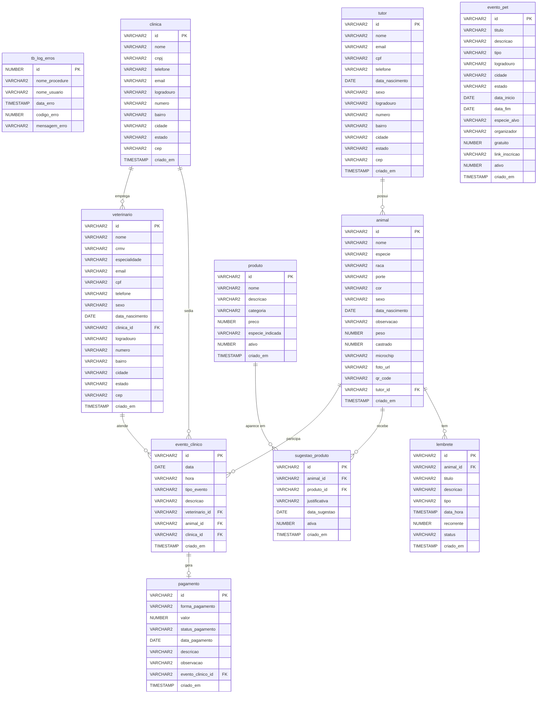

# Clyvo Vet — Banco de Dados Oracle

## Sobre o Projeto

O Clyvo Vet é uma plataforma digital de saúde animal que conecta tutores de pets, veterinários e clínicas parceiras. Este banco de dados suporta as operações centrais da plataforma: cadastro de tutores e animais, agendamento e histórico de eventos clínicos e controle de pagamentos.

O banco foi projetado para Oracle XE / SQL Developer, compatível com o ambiente da FIAP, e utiliza PKs em UUID (`VARCHAR2(36)`) para interoperabilidade direta com a camada Java (Spring Boot / `java.util.UUID`).

---

## Integrantes do Grupo

| Nome | RM |
|---|---|
| Fabrício Henrique Pereira | RM 563237 |
| Leonardo José Pereira | RM 563065 |
| Miguel Henrique Oliveira Dias | RM 565492 |
| Pedro Henrique de Oliveira | RM 562312 |

---

## Como Executar

### Pré-requisitos
- Oracle SQL Developer instalado
- Conexão com o banco Oracle XE da FIAP configurada
- Todos os arquivos `.sql` na mesma pasta

### Passo a passo

1. Abra o Oracle SQL Developer
2. Conecte-se ao banco Oracle XE
3. Execute os arquivos na ordem abaixo (Run Script — F5):

| Ordem | Arquivo | O que faz |
|---|---|---|
| 1 | `01_DDL_TABLES.sql` | Cria a função `fn_uuid()`, a sequence, as tabelas e constraints |
| 2 | `02_DDL_INDEXES.sql` | Cria os índices de performance |
| 3 | `03_VIEWS.sql` | Cria as 4 views |
| 4 | `04_PROCEDURES.sql` | Cria as 6 procedures de carga |
| 5 | `05_SEED_DATA.sql` | Insere dados de exemplo |
| 6 | `06_BLOCOS_ANONIMOS.sql` | Executa os 8 blocos de relatório |

> Os arquivos `07_ORACLE_MODELER_IMPORT.sql` e `MER_DIAGRAMA.mmd` são auxiliares (modelagem e diagrama) e não precisam ser executados no banco.

---

## Estrutura dos Arquivos

```
clyvovet-db/
├── 01_DDL_TABLES.sql            fn_uuid(), sequence, tabelas e constraints
├── 02_DDL_INDEXES.sql           Índices otimizados para performance
├── 03_VIEWS.sql                 4 views para consultas consolidadas
├── 04_PROCEDURES.sql            6 procedures de carga com tratamento de erros
├── 05_SEED_DATA.sql             Dados iniciais: clínicas, vets, tutores, animais, eventos e pagamentos
├── 06_BLOCOS_ANONIMOS.sql       8 blocos anônimos: relatórios, cursores e LAG/LEAD
├── 07_ORACLE_MODELER_IMPORT.sql DDL limpo para importação no Oracle Data Modeler
├── MER_DIAGRAMA.mmd             Diagrama ER no formato Mermaid (cole em mermaid.live)
├── MER_DIAGRAMA.html            Diagrama ER em HTML (abra no navegador)
└── README.md                    Esta documentação
```

---

## Diagrama MER



> Para visualizar interativamente: cole o conteúdo de `MER_DIAGRAMA.mmd` em [mermaid.live](https://mermaid.live), ou abra `MER_DIAGRAMA.html` no navegador.

---

## Arquitetura do Banco

O banco está organizado em 10 tabelas de negócio + 1 tabela de sistema:

```
TUTORES ────────────────────────────────────────────────────
  tutor               Tutores dos animais (dados pessoais +
                      endereço inline)

ANIMAIS ────────────────────────────────────────────────────
  animal              Perfil completo do animal vinculado a
                      um tutor (inclui peso, castrado,
                      microchip, foto e QR Code)

CLÍNICAS ───────────────────────────────────────────────────
  clinica             Clínicas parceiras (endereço inline)

VETERINÁRIOS ───────────────────────────────────────────────
  veterinario         Veterinários vinculados a uma clínica
                      (endereço inline)

EVENTOS CLÍNICOS ───────────────────────────────────────────
  evento_clinico      Consultas, vacinas, exames, retornos e
                      cirurgias — FK para animal, vet e clínica

PAGAMENTOS ─────────────────────────────────────────────────
  pagamento           Pagamento de um evento clínico (1-para-1)

CATÁLOGO ───────────────────────────────────────────────────
  produto             Catálogo de produtos e serviços
                      recomendáveis por espécie
  sugestao_produto    Recomendação de produto para um animal

LEMBRETES ──────────────────────────────────────────────────
  lembrete            Alertas personalizados por animal
                      (vacina, remédio, consulta, higiene)

EVENTOS PÚBLICOS ───────────────────────────────────────────
  evento_pet          Campanhas de vacinação, feiras e eventos
                      externos abertos ao público

SISTEMA ────────────────────────────────────────────────────
  tb_log_erros        Log de erros das procedures
```

---

## Detalhamento das Tabelas

### tutor
Cadastro dos tutores dos animais. O campo `sexo` aceita: `MASCULINO`, `FEMININO` ou `OUTRO`.

| Campo | Tipo | Descrição |
|---|---|---|
| id | VARCHAR2(36) | PK — UUID gerado por `fn_uuid()` |
| nome | VARCHAR2(120) | Nome completo |
| email | VARCHAR2(120) | Email único |
| cpf | VARCHAR2(11) | CPF único (opcional) |
| telefone | VARCHAR2(20) | Telefone de contato |
| data_nascimento | DATE | Data de nascimento |
| sexo | VARCHAR2(10) | MASCULINO / FEMININO / OUTRO |
| logradouro … cep | VARCHAR2 | Endereço inline |

---

### animal
Perfil do animal vinculado a um tutor.

| Campo | Tipo | Descrição |
|---|---|---|
| id | VARCHAR2(36) | PK — UUID |
| nome | VARCHAR2(80) | Nome do animal |
| especie | VARCHAR2(20) | CAO / GATO / AVE / REPTIL / ROEDOR / OUTRO |
| porte | VARCHAR2(10) | PEQUENO / MEDIO / GRANDE |
| sexo | VARCHAR2(10) | MACHO / FEMEA / DESCONHECIDO |
| peso | NUMBER(5,2) | Peso em kg (opcional) |
| castrado | NUMBER(1) | 0 = não / 1 = sim (DEFAULT 0) |
| microchip | VARCHAR2(50) | Código do microchip (UNIQUE) |
| foto_url | VARCHAR2(500) | URL da foto do animal |
| qr_code | VARCHAR2(100) | Código QR único do animal (UNIQUE) |
| tutor_id | VARCHAR2(36) | FK para tutor |

---

### clinica
Clínicas parceiras. O CNPJ é único.

| Campo | Tipo | Descrição |
|---|---|---|
| id | VARCHAR2(36) | PK — UUID |
| nome | VARCHAR2(120) | Nome da clínica |
| cnpj | VARCHAR2(14) | CNPJ único |
| logradouro … cep | VARCHAR2 | Endereço inline |

---

### veterinario
Veterinários vinculados a uma clínica. O CRMV é único.

| Campo | Tipo | Descrição |
|---|---|---|
| id | VARCHAR2(36) | PK — UUID |
| nome | VARCHAR2(120) | Nome completo |
| crmv | VARCHAR2(30) | CRMV único — ex: CRMV-SP 14320 |
| especialidade | VARCHAR2(80) | Especialidade principal |
| clinica_id | VARCHAR2(36) | FK para clinica |
| logradouro … cep | VARCHAR2 | Endereço inline |

---

### evento_clinico
Registro de todos os atendimentos. Tipos aceitos: `CONSULTA`, `RETORNO`, `VACINA`, `EXAME`, `CIRURGIA`, `OUTRO`.

| Campo | Tipo | Descrição |
|---|---|---|
| id | VARCHAR2(36) | PK — UUID |
| data | DATE | Data do evento |
| hora | VARCHAR2(5) | Horário no formato HH:MM |
| tipo_evento | VARCHAR2(20) | Tipo do atendimento |
| veterinario_id | VARCHAR2(36) | FK para veterinario |
| animal_id | VARCHAR2(36) | FK para animal |
| clinica_id | VARCHAR2(36) | FK para clinica |

---

### pagamento
Pagamento referente a um evento clínico. Relação 1-para-1 com `evento_clinico`.

| Campo | Tipo | Descrição |
|---|---|---|
| id | VARCHAR2(36) | PK — UUID |
| forma_pagamento | VARCHAR2(20) | PIX / CARTAO / DINHEIRO / BOLETO |
| valor | NUMBER(10,2) | Valor cobrado |
| status_pagamento | VARCHAR2(20) | PENDENTE / PAGO / CANCELADO / ESTORNADO |
| data_pagamento | DATE | Data de liquidação (NULL se pendente) |
| evento_clinico_id | VARCHAR2(36) | FK para evento_clinico (UNIQUE) |

---

### produto
Catálogo de produtos e serviços recomendáveis. Cada produto pode ser filtrado por espécie-alvo.

| Campo | Tipo | Descrição |
|---|---|---|
| id | VARCHAR2(36) | PK — UUID |
| nome | VARCHAR2(200) | Nome do produto ou serviço |
| categoria | VARCHAR2(20) | RACAO / MEDICAMENTO / ACESSORIO / SERVICO / OUTRO |
| preco | NUMBER(10,2) | Preço de referência (opcional) |
| especie_indicada | VARCHAR2(20) | CAO / GATO / AVE / REPTIL / ROEDOR / TODOS / OUTRO |
| ativo | NUMBER(1) | 0 = inativo / 1 = ativo (DEFAULT 1) |

---

### sugestao_produto
Recomendação de um produto específico para um animal. Um animal pode receber várias sugestões.

| Campo | Tipo | Descrição |
|---|---|---|
| id | VARCHAR2(36) | PK — UUID |
| animal_id | VARCHAR2(36) | FK para animal |
| produto_id | VARCHAR2(36) | FK para produto |
| justificativa | VARCHAR2(500) | Motivo da recomendação |
| data_sugestao | DATE | Data da sugestão (DEFAULT SYSDATE) |
| ativa | NUMBER(1) | 0 = inativa / 1 = ativa (DEFAULT 1) |

---

### lembrete
Alertas personalizados vinculados a um animal. Suporta lembretes únicos e recorrentes.

| Campo | Tipo | Descrição |
|---|---|---|
| id | VARCHAR2(36) | PK — UUID |
| animal_id | VARCHAR2(36) | FK para animal |
| titulo | VARCHAR2(200) | Título do lembrete |
| tipo | VARCHAR2(20) | VACINA / REMEDIO / CONSULTA / HIGIENE / OUTRO |
| data_hora | TIMESTAMP | Data e hora do disparo |
| recorrente | NUMBER(1) | 0 = único / 1 = recorrente (DEFAULT 0) |
| status | VARCHAR2(20) | PENDENTE / ENVIADO / CANCELADO (DEFAULT PENDENTE) |

---

### evento_pet
Eventos públicos externos (campanhas de vacinação, feiras pet, workshops). Não vinculado a nenhum animal específico.

| Campo | Tipo | Descrição |
|---|---|---|
| id | VARCHAR2(36) | PK — UUID |
| titulo | VARCHAR2(200) | Título do evento |
| tipo | VARCHAR2(20) | VACINACAO / FEIRA / CASTRACAO / WORKSHOP / OUTRO |
| logradouro … cep | VARCHAR2 | Endereço do evento |
| data_inicio | DATE | Data de início |
| data_fim | DATE | Data de encerramento (opcional) |
| especie_alvo | VARCHAR2(20) | Espécie-alvo (DEFAULT TODOS) |
| organizador | VARCHAR2(200) | Responsável pelo evento |
| gratuito | NUMBER(1) | 0 = pago / 1 = gratuito (DEFAULT 1) |
| link_inscricao | VARCHAR2(500) | URL de inscrição (opcional) |
| ativo | NUMBER(1) | 0 = inativo / 1 = ativo (DEFAULT 1) |

---

### tb_log_erros
Log de erros das procedures. Toda falha grava nome da procedure, usuário Oracle, data, código e mensagem de erro.

| Campo | Tipo | Descrição |
|---|---|---|
| id | NUMBER | PK — `seq_log_erros.NEXTVAL` |
| nome_procedure | VARCHAR2(100) | Procedure que falhou |
| nome_usuario | VARCHAR2(100) | Usuário Oracle (`DEFAULT USER`) |
| data_erro | TIMESTAMP | Data e hora (`DEFAULT SYSTIMESTAMP`) |
| codigo_erro | NUMBER | `SQLCODE` do Oracle |
| mensagem_erro | VARCHAR2(4000) | `SQLERRM` do Oracle |

---

## Views

### vw_eventos_completos
Painel operacional: JOIN de todas as entidades principais + LEFT JOIN com pagamento.
Uso principal: tela de histórico e painel de atendimentos.

### vw_resumo_financeiro_clinica
Faturamento consolidado por clínica. Exibe `total_recebido` (PAGO), `total_pendente` (PENDENTE) e `total_faturado` (soma geral).
Uso principal: dashboard financeiro por clínica.

### vw_historico_animal
Histórico consolidado por animal: total de eventos, primeiro e último evento, total gasto e pendente.
Uso principal: ficha do animal.

### vw_agenda_veterinario
Próximos eventos por veterinário (`WHERE data >= TRUNC(SYSDATE)`), ordenados por veterinário, data e hora.
Uso principal: agenda do dia do veterinário.

---

## Procedures

Todas as procedures seguem o mesmo padrão: recebem dados por parâmetro, validam com **2 exceções específicas** (`RAISE_APPLICATION_ERROR`), executam `COMMIT` em caso de sucesso e `ROLLBACK + INSERT em tb_log_erros` em caso de falha (`EXCEPTION WHEN OTHERS`).

| Procedure | Exceção 1 | Exceção 2 |
|---|---|---|
| `prc_inserir_tutor` | Email duplicado | CPF duplicado |
| `prc_inserir_animal` | Tutor não encontrado | Espécie inválida |
| `prc_inserir_clinica` | CNPJ duplicado | Nome + cidade já cadastrados |
| `prc_inserir_veterinario` | CRMV duplicado | Clínica não encontrada |
| `prc_inserir_evento_clinico` | Data no passado | Conflito de horário do veterinário |
| `prc_inserir_pagamento` | Evento não encontrado | Pagamento já cadastrado para o evento |

---

## Blocos Anônimos

### Bloco 1 — Eventos por clínica
JOIN entre `evento_clinico`, `clinica` e `pagamento`. Agrupa por clínica com `GROUP BY`, exibe total de eventos e faturamento, ordenado por total de eventos decrescente.

### Bloco 2 — Eventos e gastos por animal
JOIN entre `animal`, `tutor`, `evento_clinico` e `pagamento`. Agrupa por tutor, animal e espécie, exibe total de eventos e total gasto.

### Bloco 3 — Ranking de veterinários
JOIN entre `veterinario`, `clinica`, `evento_clinico` e `pagamento`. Agrupa por veterinário e especialidade, ordena por total de eventos decrescente.

### Bloco 4 — LAG/LEAD (anterior / atual / próximo)
Funções analíticas `LAG()` e `LEAD()` sobre `evento_clinico`, particionadas por `animal_id` e ordenadas por `data`/`hora`. Exibe o evento anterior, o atual e o próximo para cada animal. Usa `NVL(..., 'Vazio')` quando não há evento adjacente.

### Bloco 5 — Relatório de eventos por clínica *(cursor explícito)*
Cursor externo percorre as clínicas. Cursor interno percorre os eventos de cada clínica. `IF/ELSIF/ELSE` classifica o `tipo_evento` (CONSULTA / VACINA / EXAME / CIRURGIA / outro). Exibe subtotal por clínica e total geral.

### Bloco 6 — Relatório de animais por espécie e porte *(cursor explícito)*
Cursor `cur_todos_animais` lista todos os animais. `IF/ELSIF/ELSE` classifica o porte (PEQUENO / MEDIO / GRANDE). Cursor `cur_por_especie` exibe sumarização agrupada por espécie com contagem por porte.

### Bloco 7 — Relatório de veterinários por nível de atividade *(cursor explícito)*
Cursor percorre veterinários com contagem de eventos. `IF/ELSIF/ELSE` classifica o nível por quantidade de eventos (Muito Ativo ≥ 5 / Ativo ≥ 2 / Pouco Ativo). Exibe subtotais por especialidade.

### Bloco 8 — Relatório de pagamentos *(cursor explícito)*
Cursor percorre pagamentos com JOIN de 4 tabelas. `IF/ELSIF/ELSE` classifica o status (Quitado / A Receber / Cancelado / Estornado). Exibe contagem e total por status.

---

## Seed Data incluído

### Clínicas
| Nome | CNPJ | Cidade |
|---|---|---|
| VetCare Prime | 12345678000191 | São Paulo |
| PetMed Centro | 23456789000102 | São Paulo |
| AnimalSaúde SP | 34567890000113 | São Paulo |
| CliniPet Jardins | 45678901000124 | São Paulo |

### Veterinários
| Nome | CRMV | Especialidade | Clínica |
|---|---|---|---|
| Dra. Camila Ferreira | CRMV-SP 14320 | Clínica Geral | VetCare Prime |
| Dr. Rafael Matos | CRMV-SP 18741 | Cardiologia | PetMed Centro |
| Dr. André Costa | CRMV-SP 9812 | Ortopedia | AnimalSaúde SP |
| Dra. Lívia Rocha | CRMV-SP 16540 | Dermatologia | CliniPet Jardins |
| Dr. Tomás Oliveira | CRMV-SP 11204 | Clínica Geral | VetCare Prime |
| Dra. Beatriz Lima | CRMV-SP 20333 | Oncologia | PetMed Centro |
| Dr. Felipe Souza | CRMV-SP 25101 | Nutrição Animal | AnimalSaúde SP |

### Tutores
| Nome | CPF |
|---|---|
| Lucas M. Santos | 11100011100 |
| Maria Oliveira | 22200022200 |

### Animais
| Nome | Espécie | Porte | Tutor |
|---|---|---|---|
| Bolinha | CAO | GRANDE | Lucas M. Santos |
| Mimi | GATO | PEQUENO | Maria Oliveira |
| Rex | CAO | GRANDE | Maria Oliveira |

### Eventos e Pagamentos (resumo)
- **Bolinha**: 6 eventos (CONSULTA, VACINA, EXAME, RETORNO, VACINA, CONSULTA futura) — 4 pagamentos (PIX/CARTAO/DINHEIRO/PIX, status PAGO/PAGO/PAGO/PENDENTE)
- **Mimi**: 3 eventos (CONSULTA, VACINA, EXAME futuro) — 2 pagamentos (CARTAO PAGO, PIX PENDENTE)
- **Rex**: 2 eventos (CIRURGIA, RETORNO) — 2 pagamentos (BOLETO PAGO, PIX CANCELADO)

### Produtos
| Nome | Categoria | Espécie Indicada | Preço |
|---|---|---|---|
| Royal Canin Medium Adult | RACAO | CAO | R$ 189,90 |
| NexGard Spectra M | MEDICAMENTO | CAO | R$ 79,50 |
| Coleira antipulgas Seresto Gato | ACESSORIO | GATO | R$ 149,00 |
| Banho e Tosa Completo | SERVICO | TODOS | R$ 95,00 |

### Sugestões de Produto
| Animal | Produto | Justificativa |
|---|---|---|
| Bolinha | Royal Canin Medium Adult | Ração para Golden Retriever adulto de grande porte |
| Bolinha | NexGard Spectra M | Prevenção mensal de pulgas e carrapatos |
| Mimi | Coleira antipulgas Seresto Gato | Proteção prolongada para gatos de interior |

### Lembretes
| Animal | Tipo | Título | Data/Hora |
|---|---|---|---|
| Bolinha | VACINA | Vacina V10 - Bolinha | 15/02/2025 09:00 |
| Mimi | REMEDIO | Remedio antipulgas - Mimi | 01/06/2025 08:00 |
| Rex | CONSULTA | Consulta de retorno - Rex | 10/06/2025 10:00 |

### Eventos Pet
| Título | Tipo | Cidade | Período | Gratuito |
|---|---|---|---|---|
| Campanha de Vacinação Antirrábica 2025 | VACINACAO | São Paulo | 10/06 a 12/06/2025 | Sim |
| Feira Pet Jardins 2025 | FEIRA | São Paulo | 21/06 a 22/06/2025 | Não |

---

## Regras de Negócio Implementadas

**1. UUID como PK:** Todas as tabelas de negócio usam `VARCHAR2(36) DEFAULT fn_uuid()` como PK, compatível com `java.util.UUID.randomUUID().toString()`.

**2. Dados históricos no seed:** Eventos com datas passadas são inseridos diretamente via `INSERT` (sem a procedure `prc_inserir_evento_clinico`) porque a procedure rejeita datas no passado — regra de negócio correta para uso em produção.

**3. Conflito de horário:** A procedure `prc_inserir_evento_clinico` verifica se o veterinário já tem um evento marcado na mesma data e hora antes de confirmar.

**4. Pagamento único por evento:** A constraint `UNIQUE` em `pagamento.evento_clinico_id` e a validação na procedure garantem que cada evento clínico tenha no máximo um pagamento.

**5. Log de erros:** Toda falha em qualquer procedure é registrada em `tb_log_erros` com nome da procedure, usuário Oracle, data/hora, código e mensagem de erro.

**6. Endereço inline:** Os campos de endereço (`logradouro`, `numero`, `bairro`, `cidade`, `estado`, `cep`) ficam diretamente em `tutor`, `clinica` e `veterinario`, conforme exigência da camada Java (sem tabela separada de endereços).

---

## Decisões Técnicas

**Por que VARCHAR2(36) como PK?**
Oracle não tem UUID nativo. A função `fn_uuid()` usa `SYS_GUID()` + `REGEXP_REPLACE` para gerar UUIDs no formato `8-4-4-4-12` com hifens, idêntico ao resultado de `java.util.UUID.randomUUID().toString()`. Isso elimina conversões na camada de aplicação.

**Por que apenas uma SEQUENCE?**
Com UUID nas PKs de negócio, sequences são desnecessárias para essas tabelas. Apenas `seq_log_erros` permanece para a tabela de sistema `tb_log_erros`.

**Por que CHECK CONSTRAINTS em vez de ENUM?**
Oracle não tem o tipo ENUM. Usamos `CHECK (campo IN (...))` com os mesmos valores de texto dos enums Java (`MASCULINO`, `PIX`, `PAGO`, etc.), garantindo consistência direta com a aplicação.

**Por que endereço inline e não em tabela separada?**
A camada Java mapeia cada entidade (`Tutor`, `Clinica`, `Veterinario`) com os campos de endereço embutidos. Uma tabela separada exigiria um `@Embedded` ou `@OneToOne` extra sem benefício real neste modelo.
